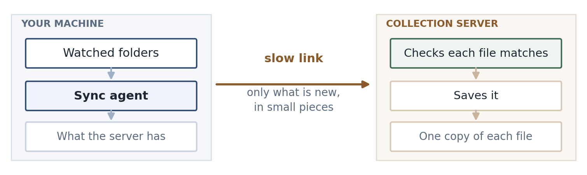
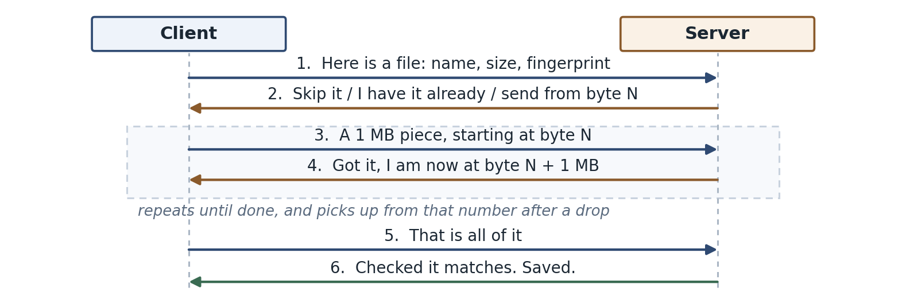

# Data Synchronisation Utility

Design document. Matthew Mikhail.

## Summary

An agent runs on the client machine, watches a set of folders, and sends anything new or changed to a collection server. It only sends what the server does not already have, and it sends it in small pieces so a dropped connection can carry on instead of starting again. The server checks every file against a fingerprint before it saves it.

## What was asked for

- Only send files that have changed since the last sync.
- Use as little bandwidth as possible.
- Handle a bad connection, without restarting a transfer from scratch.
- Let the server confirm the file it received is identical to the one on the client.

## High level design



The agent has three jobs: notice a file changed, work out whether it is worth sending, and send it.

It spots changes two ways. The operating system can tell it when a file is written, which is quick but not always reliable, so the agent also walks the folders on a timer and checks each file's size and modified time against what it saw last time. The timed scan is the one I trust; the events just make it faster.

When a file looks changed, the agent takes a SHA-256 hash of it, and that hash is the file's identity from then on. It asks the server whether it already has that hash. If it does, nothing is sent, which is what makes a rename or a copy almost free. If it does not, the file goes up in 1 MB pieces.

## How it works

- Only files whose size or modified time changed get hashed. Hashing everything on every scan would work, but it means reading every file every few minutes.
- The client asks about a batch of files in one request. The server answers each one: skip it, I already have that content, or send it from byte N.
- The file goes up in 1 MB chunks, each with its own hash, so a piece that arrives corrupted costs one chunk rather than the file.
- The server keeps track of how much it has, and the client asks rather than assuming. After a dropped connection the client picks up from the server's number.
- If a request fails the client waits and tries again, a few times, waiting a bit longer each time. If the file still will not go, it stops and reports it with the reason rather than retrying forever.
- At the end the server hashes everything it received and compares it against the hash the client gave at the start, and only saves the file if they match. So if someone edits the file while it is being sent, the server ends up with a mix of old and new bytes, that will not match, and nothing gets saved. The client sends the new version next time round.
- Paths from the client are checked and rejected if they look wrong, and are never used to build a path on the server's disk. Clients can only write in their own area, and a delete is recorded rather than actually carried out.

## The message flow



## Code

The loop that sends the file. It is short, and it is the part I would want someone to review:

```python
offset = plan["offset"]         # how much the server already has
with open(local_path, "rb") as fh:
    while True:
        fh.seek(offset)
        chunk = fh.read(chunk_size)
        if not chunk:
            break
        offset = self._put_chunk(upload_id, offset, chunk)
```

I picked this bit because it is where things go wrong if you assume too much. The loop does not keep track of its own position. It moves to whatever byte the server last reported, so resuming after a drop and starting fresh are the same few lines. The retries sit underneath it in `request()`.

## Another way it could be done

The alternative is an rsync style approach: break the file into blocks, compare them with the server, and send only the blocks that differ. It would send far less for a large file with a small edit, which is where my design is weakest. I did not go that way for a first version because the server then has to keep an index of every block of every file, and that is a lot more to build and to get right. If the files turned out to be large with small changes, I would look at it again.

## Pros and cons

Pros

- Renames and copies cost almost nothing.
- A dropped connection costs one chunk, not the whole file.
- The server can prove that what it saved is what the client read.
- No dependencies, and one small database file on the client.

Cons

- A one byte change in a 1 GB file still sends 1 GB.
- A large file has to be hashed before anything is sent, so there is a wait before the first byte moves.
- A file edited back to the same size with its timestamp put back would be missed until something hashes it again.
- Old content builds up on the server. I have not worked out how it gets cleaned up.

## Future state

- Send a list of chunk hashes in the first request so the server can say which pieces it is missing. For a log file that keeps growing, that turns a 5 GB transfer into just the end of the file.
- Handle deletes properly, and clean up partial uploads that were started and abandoned.

---

Based on SHA-256 (NIST FIPS 180-4), RFC 9110 and RFC 9530 for the HTTP behaviour, and the SQLite documentation on atomic commits. The chunk size and the retry timings are starting points and would need tuning against a real link.
