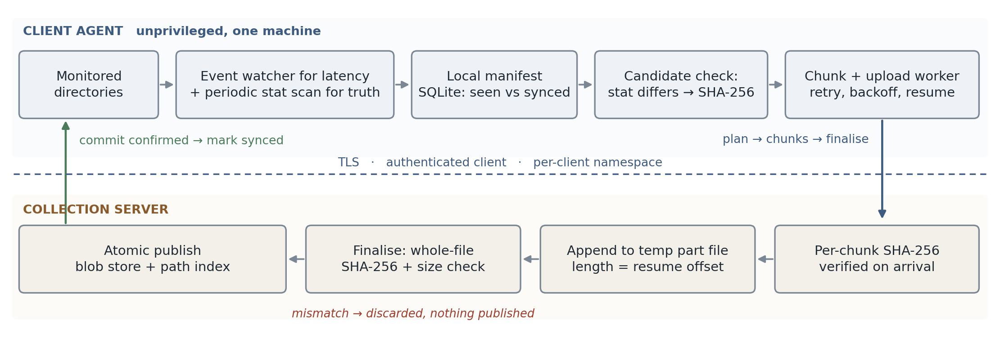

# Efficient Data Synchronisation Utility

Design document. Matthew Mikhail.

## 1. Architecture

A single unprivileged agent runs on the client machine. It has three moving parts and one piece of durable state.

- **Watcher.** Subscribes to filesystem events on the monitored directories. Its job is latency, not correctness.
- **Reconciler.** Walks the same directories on a timer using `stat()` only. This is the mechanism actually trusted for correctness, and it runs first on start-up.
- **Transfer worker.** Hashes candidate files and moves them over a resumable, chunked HTTP protocol.
- **Local manifest.** A SQLite database holding, per path, what the agent last saw on disk and what the server has confirmed. The gap between those two columns is the work queue.

The server is a content-addressed blob store plus a path index. It verifies every file it receives before publishing it.



Responsibilities stay separate: the watcher supplies hints, the reconciler establishes truth, the worker moves bytes, the manifest is the only durable client state, and the server is the sole authority on what it has received.

## 2. Change detection

Cost per pass matters more than cleverness, so the agent uses a layered check and only spends CPU when the cheap layer says something moved.

1. `stat()` gives size, mtime and inode. Compared against the manifest row this rules out almost every file for the cost of one syscall.
2. If any of those differ, the agent computes a SHA-256 over the file. That digest is the version identity for the rest of the pipeline.
3. If the server already holds that digest, nothing is sent and the manifest row is updated so the next pass is cheap again.

Hashing everything on every pass would be correct and simple, but on a large tree it is a full read of the whole dataset per interval, which is a poor trade when `stat()` answers the same question for the vast majority of files. Metadata alone is not sufficient either: mtime can move backwards after a restore or an archive extraction, and its granularity is limited. Hashing only on a metadata change gets close to the accuracy of hashing at close to the cost of `stat()`. On POSIX, `st_ctime` is a useful extra signal because user space cannot set it, though it is not portable to Windows in the same form.

Filesystem events are a latency optimisation rather than the source of truth, because the platform APIs document their own gaps. `inotify` drops events when its queue overflows and reports `IN_Q_OVERFLOW`, and it is not recursive, so each new subdirectory needs a new watch. `ReadDirectoryChangesW` discards its entire buffer on overflow and tells the caller to enumerate the directory instead. Neither sees anything that happened while the agent was not running. The periodic reconciliation scan is the backstop that makes all of those recoverable, and it is why a missed event, a crash or a power failure costs latency rather than correctness.

**Renames and deletes.** A rename appears as a new path plus a manifest row whose path no longer exists. Because the server addresses content by hash, the new path resolves to a blob it already holds, so the rename costs one small request and zero file bytes. Deletions are reported as tombstones rather than executed as destructive operations, so a buggy or compromised client cannot instruct the collection server to erase history.

## 3. Bandwidth efficiency

Four mechanisms, in order of how much they save:

- Only files whose metadata changed are considered at all.
- A **batched pre-flight request** sends `{path, size, sha256}` for a set of candidates. The server answers `skip` (it has this version at this path), `link` (it has the content under some other name) or `upload` with the offset it already holds. Renames, copies, reverts and re-installs collapse to metadata.
- Uploads are split into fixed **1 MiB chunks** and resume from the server's offset, so a dropped connection costs the chunk in flight rather than the file.
- Chunks are compressed for transport only when compression actually helps. Integrity hashes are computed over the uncompressed bytes, so compression never participates in the correctness argument.

Fixed-size chunks were chosen over content-defined chunking deliberately. Content-defined chunking pays off when transferring deltas against a previous version of the same file, which needs a per-file chunk index on the server and rolling hashes on the client. That is a materially larger system for a benefit that only appears with large files receiving small in-place edits. If telemetry showed that pattern, the first optimisation would be to carry a chunk hash list in the pre-flight request so the server can name the chunks it already holds. That is a small change on top of what is already here, which is precisely why chunks are fixed-size and content-addressed now.

## 4. Reliability

Client state is one SQLite database in WAL mode with `synchronous=FULL`. SQLite commits are atomic across process crash and power loss, so the manifest is never half-written.

One invariant makes recovery simple: **a file is marked synced only after the server has answered that it committed it.** Every failure therefore costs repeated work, never skipped work.

- *Application restart.* The agent re-scans, finds rows where the on-disk digest differs from the confirmed digest, and continues.
- *Network interruption.* The client asks the server for its offset and resumes there. The client deliberately does not cache that offset, because a second copy of the number is a second thing that can be wrong.
- *Partial transfer.* Partial data lives in a temporary area on the server, is never visible under a real path, and is garbage collected after a TTL.
- *Power failure.* The manifest is at either the old commit point or the new one. The server's partial file is either the length it last reported or shorter, and since the client re-reads the offset before resuming, a shorter file simply resumes from further back.

Retries use exponential backoff with full jitter, bounded attempts, and honour `Retry-After` when the server sends it. Jitter matters because a recovering link brings every agent back at once. Retries are safe because every endpoint is idempotent: chunk upload is a `PUT`, which RFC 9110 defines as idempotent; re-sending a chunk the server already holds returns the current offset without appending; finalising an already-committed upload returns the same success. After a bounded number of failures a file is quarantined and surfaced to an operator rather than retried forever.

## 5. Integrity and security

**Integrity.** The client computes a SHA-256 of the whole file before it reads a byte for transfer, and declares it up front. Each chunk carries its own SHA-256 in an RFC 9530 `Content-Digest` header, so in-flight corruption costs one chunk rather than a file. At finalise, the server independently hashes everything it received and compares that against the client's declared digest and expected size. Only if both match does it publish, by moving the verified blob into place with an atomic rename and then committing the path index row in a database transaction. A partial or corrupted file has no route to publication: it has no name in the store until it has been verified.

**The mid-transfer modification race.** The client re-checks size, mtime and inode before finalising, which catches the common case cheaply, but that check is an optimisation, not the guarantee. The guarantee is the server's own hash: a torn read of old and new bytes cannot match the digest the client declared before it started, so the server rejects it and publishes nothing. The client picks the file up on the next pass as a new version. The prototype includes a test that edits a file mid-upload and restores its mtime to defeat the metadata check, specifically to show that the server still refuses it.

**Honest limitations.** This detects torn reads, it does not prevent them. Without OS-level snapshots (VSS, LVM, ZFS) there is no atomic read of a file on a running system, so a continuously written file may never converge. The agent handles that by requiring a file to be metadata-stable for a short quiescence window before treating it as a candidate, and by quarantining and reporting a file that fails repeatedly. Separately, SHA-256 here proves the server holds what the client read; it says nothing about a compromised client, which controls both the bytes and the digest. That is an endpoint trust problem and no transfer protocol solves it.

**Security controls, kept proportionate.**

- TLS with certificate validation and no downgrade path. SHA-256 and TLS 1.3 are consistent with the ASD ISM's *Guidelines for Cryptography*.
- Clients are authenticated (mTLS, or a short-lived token derived from a device credential held in the OS keystore rather than a config file) and authorised to write only within their own namespace.
- Client-supplied paths are validated and rejected, not sanitised, and are never used to build a filesystem path on the server. Content lands under `blobs/<server-computed-digest>`, so path traversal has no filesystem write primitive to reach.
- The upload session identifier is derived from `(client, path, content digest)`, so a session cannot be repointed at another path to relabel content.
- Limits on file size, chunk size, batch size, per-client quota and request rate, enforced where the bytes arrive rather than against a declared size. Deduplication is scoped per client, because a digest a client has never sent should not become a capability for content another client holds.
- The agent runs as an unprivileged service account with read-only access to the monitored directories, does not follow symlinks out of them, and skips device, socket and FIFO nodes.
- Logs record paths and digests, never content.

## 6. Transfer protocol and end-to-end workflow

```
POST /v1/sync/plan             [{path, size, sha256}, ...]
      -> per file:  skip  |  linked  |  upload {upload_id, chunk_size, offset}
PUT  /v1/uploads/{id}/at/{n}   chunk bytes + Content-Digest: sha-256=:...:
      -> 200 {offset}  |  409 {offset}  |  422 chunk digest mismatch
GET  /v1/uploads/{id}          -> {offset, chunk_size}
POST /v1/uploads/{id}/finalise {path, sha256, size}
      -> 200 committed  |  409 incomplete {offset}  |  409 digest_mismatch
```

Chunks are addressed by the byte offset they start at rather than by index: an index must be read against a chunk size both sides agree on, while an offset means one thing and is the same number the server reports for resume.

1. A watcher event or reconciliation scan marks a path as a candidate: `stat()` differs from the manifest row, and the file has been metadata-stable for the quiescence window.
2. The client records `(size, mtime, inode)`, computes `SHA-256 = H`, and sends a batched plan request.
3. The server answers `skip`, `linked`, or `upload` with an upload id, chunk size and the offset it already holds.
4. The client `PUT`s chunks from that offset, each carrying its own digest. The server verifies each chunk, appends only at its current offset, and returns the new one. An interruption means re-reading the offset and continuing, not restarting.
5. The client re-`stat()`s the file. If it moved, this version is abandoned and re-queued.
6. The client posts finalise with `H` and the size. The server hashes what it received, checks both, publishes the blob atomically and commits the path index row.
7. The client writes the confirmed digest into the manifest. That commit is what makes the sync successful.

## 7. Design trade-offs

- **Whole-file rather than delta transfer.** A one-byte change in a 1 GB file costs 1 GB. Accepted for v1 because delta machinery is significant and the pre-flight chunk hash list is a small, well-understood upgrade if the workload turns out to need it.
- **Two local reads for a new file**, one to hash and one to send. Accepted because the alternative is streaming first and discovering afterwards that the server already had the content. A wasted upload on a constrained link costs far more than a local read.
- **Fixed chunk size** trades per-request overhead against the work lost when a connection drops. It is advertised by the server, so it can be tuned per link without redeploying agents.
- **No client-side offset cache and no client session table.** The server is the single authority on what it has received.
- **SQLite rather than a database service.** One file, no daemon, atomic commits, and the right size for per-machine state.
- **HTTP over a custom protocol.** Proxies, TLS termination, authentication and observability already exist for it, and the resumable pattern used here is the same one the IETF `resumable-upload` draft formalises, so there is a standards track to follow later.

---

### References

Claims above rest on: NIST FIPS 180-4 (SHA-256); RFC 9110 §9.2.2 (idempotent methods) and §10.2.3 (`Retry-After`); RFC 9530 (`Content-Digest`); `inotify(7)`; Microsoft `ReadDirectoryChangesW` documentation; SQLite *Atomic Commit*; POSIX `rename()`. Chunk sizing, backoff parameters and the quiescence window are engineering recommendations, not requirements, and would be tuned against real link and workload data.
